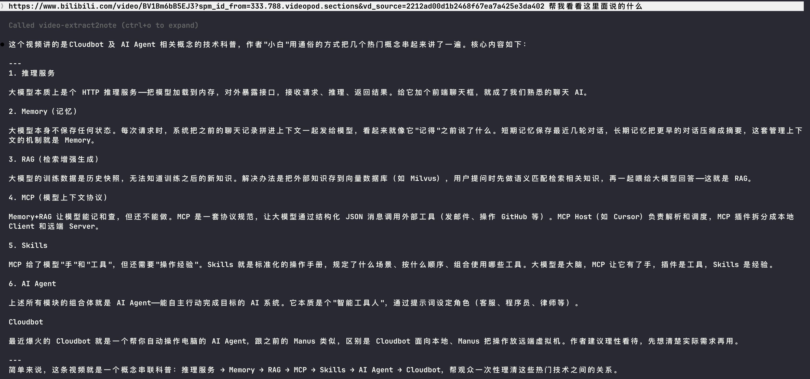

# video-extract2note


抖音/B站视频 AI 转写 + 智能格式化，支持任意网页内容抓取，集成 Claude Code MCP。

## 使用示例



Claude Code 通过 MCP 直接理解视频内容：

```
用户：https://www.bilibili.com/video/BV14sorBiEgP/ 这个视频说了什么
Claude → 调用 fetch_video_transcript → 获取转写 → 基于内容回答
```

## 功能

- **视频转写** — 支持抖音 (douyin.com, v.douyin.com) + B站 (bilibili.com, b23.tv)
- **网页内容抓取** — 抓取任意网页正文，自动识别视频/网页链接并路由到对应处理链路
- **多引擎转写** — MiMo API (云端) > whisper.cpp (Apple ANE 原生加速) > faster-whisper (CPU 回退)，自动降级
- **MiMo API** — 小米 MiMo 云端语音转文字，无需本地 GPU，支持 50MB 以内音频
- **DeepSeek V3 智能格式化** — 自动修正错别字、补标点、分段、加标题
- **Claude Code MCP 集成** — 全局可用，贴链接即可让 Claude 理解视频/网页内容
- **Web 抓取双引擎** — Playwright (JS 渲染 + 反检测) 优先，curl 降级
- **Electron 桌面端** — 视频播放 + 转写文案同时展示

## 架构

```
用户粘贴链接
  → 链接类型判断
      ├── 抖音/B站视频 → pipeline.run_pipeline()
      │     ├── 抖音: yt-dlp 下载音频 + Playwright cookie 直链
      │     ├── B站: Playwright 提取 playurl API 音频流（绕过 412 反爬）
      │     ├── MiMo / whisper.cpp (Apple ANE) / faster-whisper (CPU)
      │     ├── DeepSeek V3 格式化 (错别字、标点、分段、标题)
      │     └── 输出 PipelineResult(text)
      │
      └── 其他网页 URL → web_pipeline.run_web_pipeline()
            ├── Playwright stealth 模式（反检测 + JS 渲染）
            ├── curl + HTML 解析（降级，无 JS 渲染）
            ├── DeepSeek V3 / MiMo 格式化整理
            └── 输出 PipelineResult(text)

  → MCP Server 暴露 fetch_video_transcript / fetch_web_content 工具
  → Claude Code 任意对话中调用
```

## Requirements

- macOS (Apple Silicon)，Python 3.11+
- [whisper.cpp](https://github.com/ggerganov/whisper.cpp) (可选，Apple ANE 10x 加速)：`brew install whisper-cpp`
- [ffmpeg](https://ffmpeg.org)：`brew install ffmpeg`
- DeepSeek API key（格式化用）或 MiMo API key（转写+格式化）
- Playwright Chromium：`python -m playwright install chromium`

## 快速开始

```bash
# 1. 安装依赖
git clone <this-repo>
cd video-extract2note
python -m venv .venv && source .venv/bin/activate
pip install -e .

# 2. 安装系统工具
brew install ffmpeg whisper-cpp
python -m playwright install chromium

# 3. 配置 API key（至少配置一个，不设置则跳过对应功能）
echo 'DEEPSEEK_API_KEY=sk-xxx' >> .env     # 格式化文本
echo 'MIMO_API_KEY=your-mimo-key' >> .env   # MiMo 转写+格式化。必须得配置MIMO_API_KEY!!!

# 4. CLI 使用
video-extract2note
# 粘贴抖音/B站/网页链接即可

# 5. Claude Code MCP 集成（自动安装，重启 Claude Code 即可）
# 配置已写入 ~/.claude.json，在任意对话中贴链接即可
# 也可手动：claude mcp add --scope user video-extract2note -- bin/mcp-launcher.sh

# 6. 桌面端（Electron + Vue）
cd desktop
npm install
npm run electron:dev
```

## 环境变量

| 变量 | 说明 | 必需 |
|------|------|------|
| `DEEPSEEK_API_KEY` | DeepSeek API key（.env 自动加载，用于文本格式化） | 否 |
| `MIMO_API_KEY` | 小米 MiMo API key（.env 自动加载，用于转写+格式化） | 否 |
| `VIDEO_EXTRACT2NOTE_PYTHON` | 指定 Python 路径（Electron 用） | 否 |
| `VIDEO_EXTRACT2NOTE_COOKIES_BROWSER` | yt-dlp cookie 来源浏览器 | 否 |

> **API Key 说明**：至少配置 `DEEPSEEK_API_KEY` 或 `MIMO_API_KEY` 之一。MiMo API 同时支持转写和格式化，未配置时自动回退到其他引擎。

## 模块

| 文件 | 职责 |
|------|------|
| `pipeline.py` | 视频处理核心编排：下载音频→转写→格式化，多引擎自动降级 |
| `web_pipeline.py` | 网页处理流水线：抓取→格式化 |
| `downloader.py` | 抖音直链/B站 Playwright + yt-dlp 回退 |
| `transcriber.py` | whisper.cpp (ANE) + faster-whisper (CPU) + MiMo API (云端) |
| `transcript_formatter.py` | DeepSeek V3 / MiMo 格式化，长文本自动拆块 |
| `transcript_cleaner.py` | OpenCC 繁简转换，空格规范化 |
| `web_fetcher.py` | 网页抓取双引擎：Playwright (stealth + JS 渲染) + curl 降级 |
| `input_parser.py` | 从分享文本提取链接，识别视频/网页类型 |
| `mcp_server.py` | Claude Code MCP Server，暴露 fetch_video_transcript + fetch_web_content |
| `cli.py` | 命令行入口 |
| `desktop_bridge.py` | Electron ↔ Python JSON 桥接 |
| `desktop/` | Electron + Vue 桌面端 |

## 转写引擎

| 引擎 | 说明 | 适用场景 |
|------|------|----------|
| `auto` (默认) | MiMo > whisper.cpp > faster-whisper，自动选择可用引擎 | 日常使用 |
| `mimo` | 小米 MiMo API 云端转写，需 `MIMO_API_KEY`，限 50MB 以内音频 | 无本地 GPU，快速转写 |
| `whisper.cpp` | Apple Silicon ANE 原生加速，10 分钟视频 ~30 秒 | Mac 本地，速度最快 |
| `faster-whisper` | 本地 CPU 转写 | 无 ANE 设备回退 |

## 网络注意事项

### 网页抓取的局限

`fetch_web_content` 采用 **Playwright 优先、curl 降级** 的双引擎策略，但两种方式都依赖本地网络直连目标服务器。以下情况会导致抓取失败：

- **被墙的境外站点**：GitHub (`github.com`)、GitHub Pages (`*.github.io`)、Twitter/X、Reddit 等在中国大陆网络环境下无法直接访问，Playwright 和 curl 均会超时
- **需要登录的页面**：微信公众平台、付费文章等需要认证的页面无法抓取
- **强反爬站点**：部分站点即使使用 stealth 模式也可能被拦截

### 解决方案

- 开启系统代理/VPN 后重试（Playwright 和 curl 默认使用系统网络栈）
- 对于被墙站点，建议先确认代理可用，再用 MCP 工具抓取
- CSDN、知乎、掘金等国内站点通常可直接抓取

## 兼容性说明

- 支持抖音视频（`douyin.com/video/...`）和 B站视频（`bilibili.com/video/...`、`b23.tv`）
- 网页抓取支持任意可公开访问的 http/https URL
- B站已开启 412 反爬，使用 Playwright 浏览器提取音频流
- 抖音图文（`/note/`）不支持
- whisper.cpp 未安装时自动回退 faster-whisper（CPU，较慢）
- MiMo API 音频限 50MB 以内，超出自动降级到其他引擎
- DeepSeek API key 未设置时跳过格式化，直接输出转写原文
